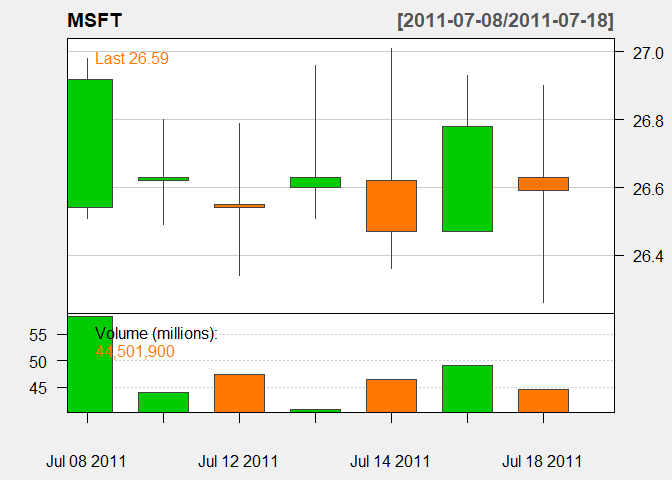

CandleStickPattern
==================

This package finds common candle stick patterns using daily data (OHLC data).

Overview
--------

Currently, it covers the following patterns:

-   Doji family (1-day pattern)
    -   Doji
    -   Dragonfly Doji
    -   Gravestone Doji
-   Harmer family (2-day pattern)
    -   Harmer
    -   Hangman
    -   Inverted Harmer
    -   Shooting Star
-   Engulfing family (2-day pattern)
    -   Bullish Engulfing
    -   Bearish Engulfing
-   Harami family (2-day pattern)
    -   Bullish Harami
    -   Bearish Harami
-   Reversal family (2-day pattern)
    -   Pierceing line
    -   Dark cloud Cover
-   Kicking family (2-day pattern)
    -   Kicking up
    -   Kicking down
-   Three in a row (3-day pattern)
    -   Three white soldiers
    -   Three Black crows
-   Star (3-day pattern)
    -   Morning star
    -   Evening star
-   Three Method (5-day pattern)
    -   Rising three
    -   Falling three

Installation
------------

To install this package, it is the easist to use devtools:

``` r
#install.packages("devtools")
library(devtools)
```

Then we can use the `install_github` to get the package directly:

``` r
#install_github("kochiuyu/CandleStickPattern")
library(CandleStickPattern)
```

Usage
-----

The following demonstrates the usage of the pacakge using Microsoft (ticker: MSFT). We use **quantmod** package to download data:

``` r
library(quantmod)
getSymbols("MSFT", from = "2011-07-08" , to = "2011-07-19")
```

We first plot the candle chart first:

``` r
candleChart(MSFT,theme='white')
```



We can see that July 11, 12, 13 and 18 are likely to follow **doji** pattern. Let us see if we can capture using the function `doji`:

``` r
library(CandleStickPattern)
doji(MSFT)
```

    ##             doji
    ## 2011-07-08 FALSE
    ## 2011-07-11  TRUE
    ## 2011-07-12  TRUE
    ## 2011-07-13  TRUE
    ## 2011-07-14 FALSE
    ## 2011-07-15 FALSE
    ## 2011-07-18  TRUE
