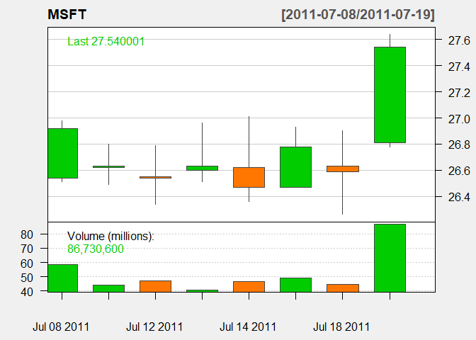

CandleStickPattern
==================

This package finds common candle stick patterns using daily data (OHLC data).

Overview
--------

The current version package covers the following patterns:

-   Doji family (1-day pattern)
    -   Doji `doji()`
    -   Dragonfly Doji `dragonfly.doji()`
    -   Gravestone Doji `gravestone.doji()`
-   Hammer family (2-day pattern)
    -   Hammer/Hangman `hammer()`
    -   Inverted Hammer/Shooting Star `inverted.hammer`
-   Engulfing family (2-day pattern)
    -   Bullish Engulfing `bullish.engulf()`
    -   Bearish Engulfing `bearish.engulf()`
-   Harami family (2-day pattern)
    -   Bullish Harami `bullish.engulf()`
    -   Bearish Harami `bearish.harami()`
-   Reversal family (2-day pattern)
    -   Piercing line `piercing.line()`
    -   Dark cloud Cover `dark.cloud.cover()`
-   Kicking family (2-day pattern)
    -   Kick up `kick.up()`
    -   Kick down `kick.down()`
-   Three-in-a-row (3-day pattern)
    -   Three white soldiers `three.white.soliders()`
    -   Three Black crows `three.black.crows()`
-   Star (3-day pattern)
    -   Morning star `morning.star()`
    -   Evening star `evening.star()`
-   Three Method (5-day pattern)
    -   Rising three `rising.three()`
    -   Falling three `falling.three()`

Moreover, it captures trends using exponential moving average (EMA):

-   EMA trends
    -   up trend `up.trend()`
    -   down trend `down.trend()`

Installation
------------

To install this package, it is the easist to install `devtools` package first:

``` r
install.packages("devtools")
```

Now load the package using `library()`

``` r
library(devtools)
```

Then we can use the `install_github` to get the package directly:

``` r
install_github("kochiuyu/CandleStickPattern")
```

Finally, we load the package using `library()`

``` r
library(CandleStickPattern)
```

Usage
-----

You can see the details of how each function works in [vignette](http://htmlpreview.github.io/?https://github.com/kochiuyu/CandleStickPattern/blob/master/vignettes/CandleStick.html)

The following demonstrates the usage of the function `doji()` using Microsoft (ticker: MSFT). We use **quantmod** package to download data:

``` r
library(quantmod)
getSymbols("MSFT", from = "2011-07-08" , to = "2011-07-19")
```

We first plot the candle chart first:

``` r
candleChart(MSFT,theme='white')
```



We can see that July 11, 12, 13, and 18 are likely to follow **doji** pattern. Let us see if we can capture using the function `doji`:

``` r
library(CandleStickPattern)
```

    ## 
    ## Attaching package: 'CandleStickPattern'

    ## The following object is masked _by_ '.GlobalEnv':
    ## 
    ##     MSFT

``` r
doji(MSFT)
```

    ##             doji
    ## 2011-07-08 FALSE
    ## 2011-07-11  TRUE
    ## 2011-07-12  TRUE
    ## 2011-07-13  TRUE
    ## 2011-07-14 FALSE
    ## 2011-07-15 FALSE
    ## 2011-07-18  TRUE
